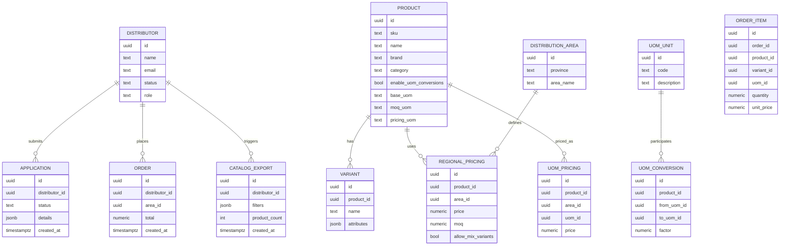
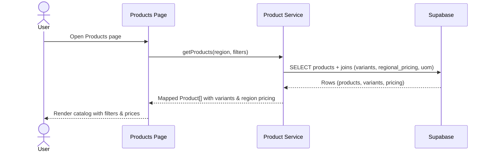
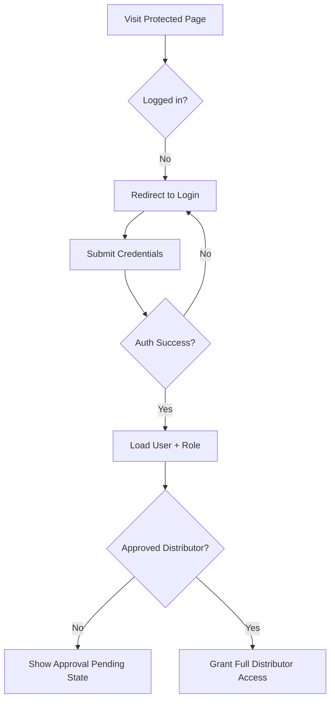
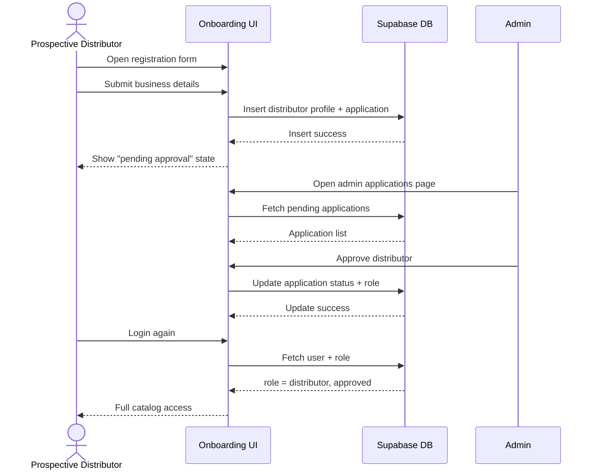
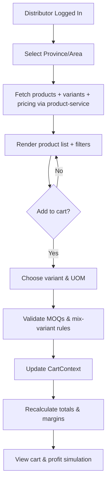
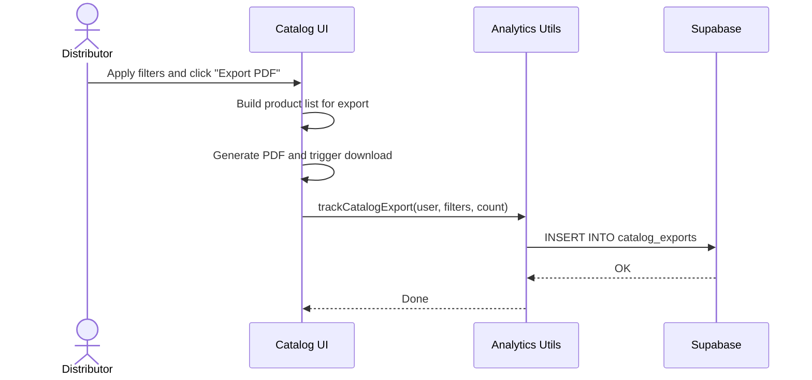

# Complete Technical Documentation – Baskit Distributor Hub

## 1. Product Overview & Background

| Item              | Description |
|-------------------|------------|
| Product Name      | Baskit Distributor Hub |
| Domain            | FMCG distributor enablement (Indonesia) |
| Primary Goal      | Digital portal for official distributors to browse SKUs, see regional pricing, simulate profit, and manage onboarding |
| Target Platforms  | Web (SPA) – desktop and mobile responsive |
| Deployment Models | Static SPA (Vercel, Cloudflare Pages, PM2 server) with Supabase backend |

### 1.1 User Personas

| Persona             | Needs | Key Journeys |
|---------------------|-------|--------------|
| Prospective Distributor | Understand catalog, regional pricing, and potential margin before signing | Browse catalog → Filter by region/brand → Simulate profit → Register as distributor |
| Active Distributor  | Maintain access to updated SKUs, accurate UOM-based pricing, convenient cart and export | Login → Filter catalog → Build cart with UOM/variants → Export catalog PDF → Use in field |
| Admin / Baskit Ops  | Configure SKUs, UOM rules, regional pricing, variants, RLS, and see analytics | Login as admin → Manage products/UOM/pricing → Approve distributors → Review analytics |

### 1.2 Core Value Propositions

- Central single source of truth for SKUs, variants, and regional pricing.
- Accurate profit and margin simulation using live pricing and UOM conversions.
- Streamlined distributor onboarding and approval workflow.
- Exportable PDF catalog for offline/field usage.
- Secure access with Supabase auth and role-based restrictions.

---

## 2. Users, Roles, and Permissions

### 2.1 Roles

| Role         | Description | Access Highlights |
|--------------|-------------|-------------------|
| Guest        | Unauthenticated visitor | Public marketing pages, limited catalog previews (if enabled) |
| Pending      | Authenticated but not yet approved distributor | Basic profile screens, approval-pending messaging, no sensitive catalog/pricing |
| Distributor  | Approved distributor | Full catalog & pricing, cart, profit simulation, PDF export, own analytics |
| Admin        | Internal Baskit ops/admin | Everything distributor has + admin dashboard, SKU/UOM/pricing config, RLS-sensitive data, global analytics |

### 2.2 Permission Matrix (High Level)

| Feature / Action                         | Guest | Pending | Distributor | Admin |
|-----------------------------------------|:-----:|:-------:|:----------:|:-----:|
| View marketing/home pages               |  ✅   |   ✅    |     ✅     |  ✅  |
| Register as distributor                 |  ✅   |   –     |     –      |  –   |
| Login                                   |  ✅   |   ✅    |     ✅     |  ✅  |
| View full catalog with prices           |  ❌   |   ❌    |     ✅     |  ✅  |
| Use cart & profit simulation            |  ❌   |   ❌    |     ✅     |  ✅  |
| Export catalog PDF                      |  ❌   |   ❌    |     ✅     |  ✅  |
| View own profile & basic analytics      |  ❌   |   ✅    |     ✅     |  ✅  |
| View global analytics dashboard         |  ❌   |   ❌    |     ❌     |  ✅  |
| Manage SKUs/UOM/variants/pricing        |  ❌   |   ❌    |     ❌     |  ✅  |
| Approve/reject distributor applications |  ❌   |   ❌    |     ❌     |  ✅  |

Implementation:

- Supabase Auth (roles via `raw_app_meta_data.role`).
- Frontend guards: AuthContext + `ProtectedRoute`, `AdminRoute`, `ApprovedRoute`, `RoleBasedRoute`.
- Backend RLS: per-table policies ensuring users see only allowed rows.

---

## 3. Functional Requirements (Summary)

### 3.1 Key Functional Areas

- Authentication & Authorization (Supabase auth + role-based routing).
- Distributor onboarding and approval workflow.
- Product catalog browsing with filters and search.
- UOM and regional pricing management.
- Cart and order-preparation with profit simulation.
- Catalog export to PDF with analytics tracking.
- Localization (Bahasa Indonesia, extensible).

### 3.2 Sample Requirements Table

| ID   | Category          | Requirement (Short) |
|------|-------------------|---------------------|
| FR-1 | Auth              | Users can register and log in via Supabase auth. |
| FR-6 | Onboarding        | Prospective distributors can submit registration and create a distributor profile. |
| FR-9 | Catalog           | Distributors can browse products with key attributes and filters. |
| FR-14| UOM & Pricing     | Each product must define base, MOQ, and pricing UOM with conversion factors. |
| FR-18| Cart & Simulation | Distributors can add items to a cart and see real-time totals and margins. |
| FR-21| Export & Analytics| Users can export filtered catalogs to PDF and track export events. |
| FR-25| Localization      | UI supports at least Bahasa Indonesia. |

Non-functional requirements include performance (fast catalog load and export), reliability (reproducible migrations), security (RLS + guards), and maintainability (modular TS codebase with clear structure).

---

## 4. System Design & Architecture

### 4.1 High-Level Architecture Diagram

```mermaid
flowchart LR
    subgraph Client[Client / Browser]
        UI[React SPA (Vite, shadcn-ui, Tailwind)]
        Ctx[Contexts & Hooks<br/>Auth / Cart / Language]
    end

    subgraph Services[Service & Integration Layer]
        PS[Product Service]
        AS[Auth & Security Utils]
        CS[Cart & Pricing Logic]
        AN[Analytics Utils]
    end

    subgraph Supabase[Supabase Backend]
        AUTH[Auth]
        DB[(Postgres DB)]
        RLS[Row Level Security]
        VIEWS[DB Views & Analytics]
    end

    Client --> UI --> Ctx --> Services
    Services --> AUTH
    Services --> DB
    DB --> RLS
    DB --> VIEWS

    subgraph External[External Integrations]
        W3F[Web3Forms]
        S3[S3-compatible Storage]
    end

    UI --> W3F
    UI --> S3
```

### 4.2 Frontend Architecture

- Entry: `main.tsx`, `App.tsx` bootstrapping routing and global providers.
- Pages: home, products, auth, profile, admin, analytics, etc.
- Components: admin (SKU manager, analytics), cart, layout, auth, shared UI.
- State: React Contexts for auth, cart, and language; hooks like `use-auth`, `use-cart`, `use-language`, `use-secure-api`, `use-analytics`.
- Services: `product-service` centralizes product/variant/pricing queries and mapping from Supabase rows.

### 4.3 Backend & Data Architecture

- Supabase provides:
  - Auth (JWT, roles in `raw_app_meta_data`).
  - Postgres DB with RLS.
  - Storage (for product images where used).
- Database schema (see Section 5) includes products, variants, regional pricing, UOM tables, orders/analytics, and catalog exports.
- Views like `variants_view`, `distributor_order_analytics`, `export_analytics` optimize read access.

### 4.4 Security Architecture

- Frontend guards: auth utilities and ProtectedRoute variants enforce access control before rendering.
- `use-secure-api` wraps service calls with auth validation and error handling.
- RLS policies protect distributor profiles, orders, analytics data, and any sensitive operations, with admin overrides.

### 4.5 Deployment Architecture

- SPA built via `npm run build` / `npm run build:vercel` / `npm run build:cloudflare`.
- Hosting:
  - Vercel (via `vercel.json`).
  - Cloudflare Pages (`wrangler.toml`, security headers).
  - PM2-based Node serve (optional) via `ecosystem.config.cjs` and `deploy.sh`.

---

## 5. Database Schema (Conceptual)

### 5.1 Core Tables (Conceptual ERD)



> Note: Actual column names/types follow Supabase migrations; this ERD is conceptual but aligned with the docs (uom-implementation, analytics, RLS fixes).

---

## 6. Tech Stack

| Layer        | Technology |
|-------------|------------|
| Language    | TypeScript |
| Framework   | React 18 |
| Build Tool  | Vite |
| UI Library  | shadcn-ui (Radix) + Tailwind CSS |
| Routing     | React Router-based pages and route components |
| State       | React Context + custom hooks |
| Backend     | Supabase (Auth, Postgres, RLS, Storage) |
| Analytics   | Supabase views + custom React dashboards |
| Forms       | React Hook Form + Zod |
| Maps        | Leaflet |
| Deployment  | Vercel, Cloudflare Pages, PM2-based servers |

See README and individual tech docs for further details.

---

## 7. API & Service Design

### 7.1 Service Responsibilities (Frontend-facing)

| Service / Module      | Responsibility |
|-----------------------|----------------|
| Product Service       | Fetches products, variants, regional pricing; maps DB rows to rich `Product` models. |
| Auth Guards / Utils   | Validate authentication and roles before service calls and route access. |
| Cart Logic            | Manages cart items, enforces MOQs and mix-variant rules, calculates totals. |
| Analytics Utils       | Track catalog exports and derive analytics queries. |
| UOM Helpers           | Apply UOM conversions and pricing lookups. |

### 7.2 Example Pseudo-API Flow (Product Fetch)



### 7.3 Security Considerations

- All privileged operations go through `requireAuth` / `requireAdmin` wrappers.
- Frontend never constructs raw SQL; all DB access uses Supabase client.
- RLS policies provide final enforcement in the database.

---

## 8. Key User Flows

### 8.1 Authentication & Role Flow



### 8.2 Distributor Registration & Approval



### 8.3 Catalog Browsing & Cart Flow



### 8.4 Catalog Export & Analytics



---

## 9. Code Structure & Key Modules

### 9.1 High-Level Code Map

| Path                           | Responsibility |
|--------------------------------|----------------|
| src/components/admin           | Admin dashboards, SKU manager, analytics UIs |
| src/components/cart            | Cart and profit simulation UI |
| src/components/layout          | Layout, navigation, shell |
| src/components/auth            | Login, registration, ProtectedRoute components |
| src/components/ui              | shadcn-ui primitives |
| src/contexts                   | Context providers (Auth, Cart, Language) |
| src/hooks                      | Custom hooks (`use-auth`, `use-cart`, `use-language`, `use-secure-api`, `use-analytics`, etc.) |
| src/services                   | Business logic and Supabase-facing services (e.g., product-service) |
| src/integrations/supabase      | Supabase client and generated types |
| src/utils                      | Utilities (auth-guards, analytics, UOM helpers, formatting, validation, pdf utils) |
| src/pages                      | Top-level route components/pages |

### 9.2 Example Code Explanations (Conceptual)

- `product-service`:
  - Encapsulates all product-related Supabase queries.
  - Uses `mapDBProductToProduct` to convert raw rows + joins into strongly typed `Product` entities.
  - Centralizes regional pricing and UOM data mapping so the UI remains simple.

- `auth-guards` and `ProtectedRoute` components:
  - Provide reusable functions to ensure the user is logged in and has the correct role before performing actions.
  - Handle redirects and error messaging consistently across the app.

- `CartContext` & cart helpers:
  - Store cart items in a React Context with derived selectors for totals and margin.
  - Enforce business rules like minimum order quantities and variant mixing policies.

---

## 10. Security & Compliance Summary

- Supabase RLS protects distributor-specific data (profiles, orders, analytics, exports) and admin-only operations.
- Frontend route and service guards prevent unauthorized actions from the UI.
- API access patterns avoid direct SQL and rely on typed Supabase client calls.
- Security hardening steps and fixes are documented separately in security docs (`API_SECURITY`, RLS fix docs, comprehensive assessments).

---

## 11. Future Enhancements (High Level)

- Deeper analytics (product popularity, engagement metrics, CSV/Excel export).
- Advanced pricing models (time-based, tiered quantity discounts).
- Additional security features (2FA, stricter rate limiting and IP-based controls).
- More extensive localization and multi-language content.
