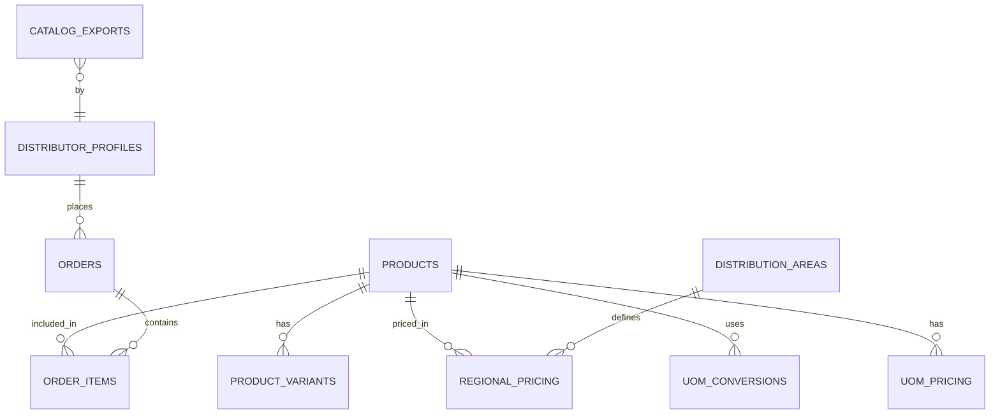
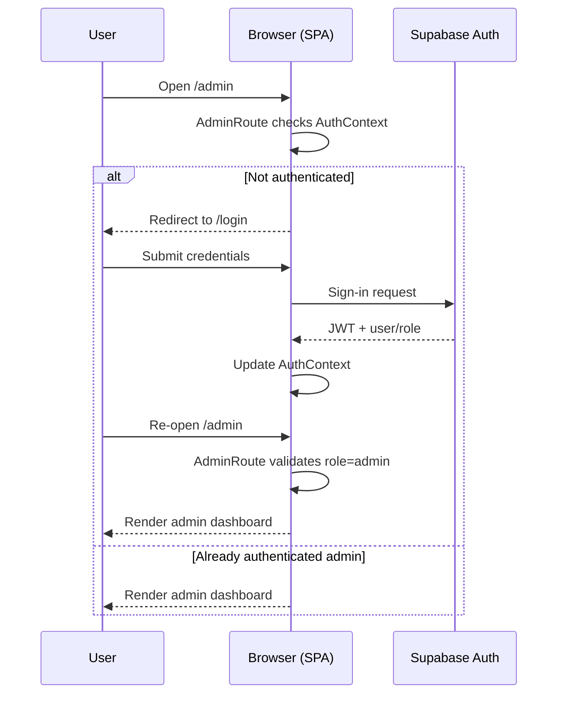
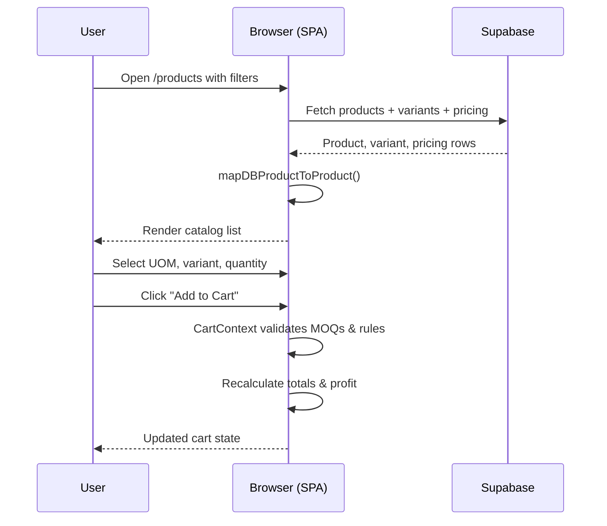

# Distrihub – Product and Technical Document

## 1. Executive Summary

Baskit Distributor Hub ("Distrihub") is a web-based platform for FMCG distributors in Indonesia. It centralizes product catalogs, regional pricing, UOM (Unit of Measure) rules, and distributor onboarding into a single portal.

This document provides an end-to-end view:
- Product vision and user personas
- Detailed functional and non-functional requirements
- System and data architecture
- Key application flows
- Tech stack overview
- Textual ERD and diagrams to support future visual modeling

---

## 2. Product Overview & Knowledge

### 2.1 Product Definition
- **Name**: Baskit Distributor Hub (Distrihub)
- **Domain**: FMCG distributor enablement (Indonesia focus)
- **Purpose**: Digital portal for official distributors to:
  - Browse and filter SKUs with regional pricing and MOQs.
  - Configure orders across multiple UOMs and mixed variants.
  - Simulate profit and margin before placing orders.
  - Register and maintain distributor profiles.

### 2.2 Primary User Personas
- **Prospective Distributor**
  - Goals:
    - Understand available SKUs and pricing for their area.
    - Estimate profitability before committing to partnership.
  - Key Journeys:
    - Browse public/limited catalog.
    - Filter by province/area and brand.
    - Trigger registration/onboarding flow.

- **Active Distributor**
  - Goals:
    - Access up-to-date catalog and regional pricing.
    - Quickly build and adjust carts using multiple UOMs.
    - Export catalogs for internal sales teams.
  - Key Journeys:
    - Login → Select area → Explore products & variants.
    - Add items to cart with correct MOQs and UOMs.
    - Simulate margin and finalize an order plan.
    - Export filtered catalog to PDF.

- **Admin / Baskit Operations**
  - Goals:
    - Maintain SKUs, UOM configuration, pricing, and variants.
    - Enforce security (RLS, admin-only operations).
    - Approve distributors and monitor engagement/analytics.
  - Key Journeys:
    - Login as admin → Open admin console.
    - Manage products, UOM rules, and regional pricing.
    - Review distributor applications and approve.
    - View analytics dashboards and export reports.

### 2.3 Core Value Propositions
- Single source of truth for SKUs, variants, and pricing per region.
- Accurate profit simulation using live pricing and UOM conversion logic.
- Secure, auditable onboarding and role-based access control.
- Offline enablement via PDF catalog exports.
- Centralized analytics for catalog export usage and order statistics.

### 2.4 Key Capabilities (High-Level)
- Rich catalog browsing with multi-filtering and region selection.
- End-to-end UOM system (units, conversions, per-UOM pricing).
- Distributor registration, profile, and approval lifecycle.
- Cart and pre-order management with MOQs and mixed-variant rules.
- Analytics dashboards using Supabase tables and views.
- Strong security posture with multi-layer RLS and frontend guards.

---

## 3. Product Requirements (Functional & Non-Functional)

### 3.1 Authentication & Authorization
- **FR-1**: Users must register and log in via Supabase Auth.
- **FR-2**: System must support at least roles:
  - `pending` distributor (registration submitted, not yet approved),
  - `distributor` (approved),
  - `admin`.
- **FR-3**: Only authenticated and approved distributors may access full catalog pricing and cart features.
- **FR-4**: Only admins may access admin UI, SKU management, UOM/pricing configuration, and global analytics.
- **FR-5**: Routes and APIs must be protected:
  - Route level: `ProtectedRoute`, `AdminRoute`, `ApprovedRoute`, `RoleBasedRoute`.
  - API/service level: `requireAuth`, `requireAuthForViewing`, `requireAdmin`, `validateAuth`.

### 3.2 Distributor Onboarding
- **FR-6**: Prospective distributors can submit registration forms capturing profile details (company, address, regions, contact).
- **FR-7**: A distributor profile and/or application record must be persisted in Supabase.
- **FR-8**: RLS must ensure that each distributor sees only their own profile/application.
- **FR-9**: Admin users can list and review pending applications.
- **FR-10**: Admins can approve or reject applications, updating roles/flags accordingly.
- **FR-11**: Pending distributors see a clear "awaiting approval" state and are blocked from sensitive operations.

### 3.3 Product Catalog & Browsing
- **FR-12**: Users can browse a catalog of products with at least:
  - SKU, name, size, brand, category.
  - Base UOM information.
  - Region-specific pricing summary.
- **FR-13**: Users can filter products by:
  - Region/area (distribution area, province/city),
  - Brand,
  - Category,
  - Search keyword (name/SKU).
- **FR-14**: For each product, system must show:
  - Available variants and variant descriptions.
  - Region-specific pricing and MOQs.
  - UOM configuration (base, pricing, MOQ UOMs).
- **FR-15**: Catalog must support mixed variants where allowed (per product and region settings).
- **FR-16**: Product data is sourced from Supabase tables/views: `products`, `product_variants`, `variants_view`, `regional_pricing`, etc.

### 3.4 UOM & Pricing
- **FR-17**: Each product record must include:
  - `base_uom`, `moq_uom`, `pricing_uom`, `enable_uom_conversions`.
- **FR-18**: System must enable admin configuration of:
  - UOM units (`uom_units`),
  - UOM conversions per product (`uom_conversions`),
  - Per-UOM pricing per area (`uom_pricing`).
- **FR-19**: When `enable_uom_conversions = true`:
  - Users can select alternative UOMs for the same product.
  - Quantities and MOQs are converted between units using `conversion_factor`.
- **FR-20**: Region-specific and UOM-specific pricing must be accurately reflected in the UI and cart.

### 3.5 Cart & Order Preparation
- **FR-21**: Distributors can add products to a cart with:
  - Chosen UOM,
  - Optional variant(s),
  - Quantity, and region.
- **FR-22**: Cart logic must enforce:
  - Minimum order quantities (MOQs),
  - SKU-level MOQs (`single_sku_moq`),
  - Mix variant constraints (`allow_mix_variants`) at product and region levels.
- **FR-23**: The cart must compute for each line and for totals:
  - Distributor cost,
  - Reference/retail price,
  - Estimated profit and margin.
- **FR-24**: Cart should support adjustments (change UOM/quantity/variant) and recalculate totals in real-time.

### 3.6 Catalog Export & Analytics
- **FR-25**: Users can export the currently filtered catalog to a PDF document.
- **FR-26**: The system must record each export in `catalog_exports` with:
  - User ID,
  - Timestamp,
  - Number of products exported,
  - Key filters (area, brand, price range, etc.).
- **FR-27**: Analytics views (`export_analytics`, `distributor_order_analytics`) must provide aggregated insights such as:
  - Total exports over time,
  - Exports per region/brand,
  - Order status distribution.
- **FR-28**: Admin dashboards can visualize these analytics; distributors may see a restricted subset limited to their own data.

### 3.7 Localization
- **FR-29**: UI must support Bahasa Indonesia with potential extension to more languages.
- **FR-30**: Language selection must persist in `LanguageContext` and be applied across all pages.

### 3.8 Security & Compliance
- **FR-31**: RLS policies must enforce row-level access across key tables (`distributor_profiles`, `orders`, `catalog_exports`, etc.).
- **FR-32**: Product catalog may be broadly readable, but any data tied to distributor identity or sensitive analytics must be restricted.
- **FR-33**: All service methods that change or read sensitive data must be wrapped with appropriate auth guard checks.

### 3.9 Non-Functional Requirements
- **NFR-1 (Performance)**: Catalog pages should load within acceptable time for typical dataset sizes, using Supabase views and efficient queries.
- **NFR-2 (Performance)**: PDF exports should complete within seconds for typical catalog sizes.
- **NFR-3 (Reliability)**: Database migrations must run in deterministic order via `npm run db:migrate` and scripts (e.g., `apply-db-fixes.sh`).
- **NFR-4 (Reliability)**: Seed scripts must be safe for development/test environments (`npm run db:seed`).
- **NFR-5 (Security)**: APIs and services must use auth guards and RLS as defense-in-depth.
- **NFR-6 (Maintainability)**: Code must remain modular with clear separation into `components`, `services`, `contexts`, `hooks`, `utils`, and well-defined TypeScript types.
- **NFR-7 (Scalability)**: Architecture should support horizontal scaling at the hosting and database levels (through Supabase and static hosting platforms).

---

## 4. System Architecture

### 4.1 High-Level Layers
- **Client/UI Layer**
  - React 18 SPA using shadcn-ui + Tailwind for UI.
  - Organized into `src/pages`, `src/components`, `src/contexts`, `src/hooks`.
- **Service & Integration Layer**
  - `src/services`: business-facing services (e.g., `product-service.ts`).
  - `src/integrations/supabase`: Supabase client, types, and extended helpers.
  - `src/utils`: shared utilities (auth guards, analytics, PDF utils, formatting).
- **Data Layer (Supabase)**
  - Postgres database with SQL migrations in `supabase/migrations`.
  - RLS policies and security fixes documented under `docs` and `security`.
- **Deployment Layer**
  - Vercel/Cloudflare Pages/static hosting for the frontend.
  - Optional PM2/Node-based hosting with `ecosystem.config.cjs` and `deploy.sh`.

### 4.2 Frontend Composition
- **Entry points**: `main.tsx`, `App.tsx` configure routing and wrap the app with providers.
- **Routes / Pages** (under `src/pages`):
  - `home`, `about`, `contact`: marketing/overview pages.
  - `auth`: login, registration, password-related pages.
  - `products`: product catalog and product details views.
  - `orders`: order list, order detail, and cart-related pages.
  - `profile`: distributor profile and settings.
  - `admin`: admin console, SKU management, UOM/pricing tools, analytics dashboard.

- **Components** (`src/components`):
  - `admin/`: SKUManager, UOM config forms, pricing matrices, analytics widgets.
  - `cart/`: cart icon, cart drawer/page, line-item components.
  - `auth/`: forms, ProtectedRoute/Role-based wrappers.
  - `layout/`: shell, navigation, footers, responsive layout pieces.
  - `ui/`: design system primitives from shadcn-ui.

### 4.3 State Management & Hooks
- **Contexts** (`src/contexts`):
  - `AuthContext`: manages user object, roles, approval state, and loading flags.
  - `CartContext`: manages cart items, totals, operations for add/update/remove.
  - `LanguageContext`: manages active language and translations.

- **Hooks** (`src/hooks`):
  - `use-auth`: convenience wrapper around AuthContext.
  - `use-cart`: wrapper around CartContext, including business logic (e.g., MOQs).
  - `use-secure-api`: wraps service calls with auth checks and standardized error handling.
  - `use-analytics`: fetches and formats analytics for dashboards.
  - `use-language`, `use-mobile`, `use-toast`, etc. for UI and UX helpers.

### 4.4 Services & Utilities
- **Product Service** (`src/services/product-service.ts`):
  - Encapsulates queries to `products`, `product_variants`, `regional_pricing`, `variants_view`, etc.
  - Maps `ProductFromDB` + `RegionPricingFromDB` + variants into frontend-friendly `Product` objects via `mapDBProductToProduct`.

- **Utilities** (`src/utils`):
  - `auth-guards.ts`: central auth & role guard functions.
  - `analytics.ts`: `trackCatalogExport` and related helpers.
  - `mixVariants.ts`, `catalog/`, `pdf-utils.ts`: rules and utilities for variant mixing and PDF generation.
  - `format.ts`, `validation.ts`, `helpers.ts`: formatting, validation, and generic helpers.

### 4.5 Backend / Data Architecture
- **Supabase Auth**: manages users, sessions, and JWT tokens with roles defined in `raw_app_meta_data`.
- **Database Schema (high-level)**:
  - Products and variants.
  - Regional pricing and distribution areas.
  - UOM units, conversions, and pricing.
  - Distributor profiles and applications.
  - Orders and order items.
  - Analytics tables (`catalog_exports`) and views (`distributor_order_analytics`, `export_analytics`).

- **Data Access Patterns**:
  - Frontend calls Supabase via the `supabase` client using standard `from().select().insert().update()` patterns.
  - Views are used to optimize complex joins and analytics.

### 4.6 Security Architecture
- **Frontend**:
  - Route protection via ProtectedRoute family.
  - API/service protection via `auth-guards.ts`.
  - Secure hooks (`use-secure-api`) to wrap service calls.

- **Backend (Supabase)**:
  - RLS enabled on key tables, ensuring user-specific visibility.
  - Additional security hardening scripts and docs: distributor and products RLS fixes.

### 4.7 Deployment Architecture
- Built via `npm run build` or environment-specific variants (`build:vercel`, `build:cloudflare`).
- Deployed to:
  - Vercel (via `vercel.json`),
  - Cloudflare Pages (via `wrangler.toml` + headers),
  - or other static hosting (serving `dist/`).
- Optional PM2-based deployment for Node hosting with `ecosystem.config.cjs`.

---

## 5. Application Flows (End-to-End)

### 5.1 Authentication & Role Flow
1. User opens Distrihub in browser.
2. If user requests a protected route (`/products`, `/orders`, `/admin`):
   - `ProtectedRoute` / `AdminRoute` / `ApprovedRoute` checks `AuthContext`.
   - If unauthenticated → redirect to login.
3. At login:
   - User submits credentials.
   - Supabase Auth validates and returns a JWT with role metadata.
   - AuthContext stores user, roles, and approval status.
4. On subsequent route checks:
   - If user is `admin`, they can access admin routes.
   - If user is `distributor` but not approved, `ApprovedRoute` blocks and shows "approval pending".
   - If user is approved distributor, they access catalog, cart, and profile pages.

### 5.2 Distributor Registration & Approval Flow
1. Prospective distributor navigates to registration page.
2. User fills in business and contact details and submits.
3. Frontend creates records in `distributor_profiles` and/or `applications` via Supabase.
4. RLS ensures only that user and admins see these records.
5. Admin logs into admin portal and opens the applications view.
6. Admin reviews application details and marks application as approved.
7. Backend updates role/flags (e.g., `role = distributor`, `approved = true`).
8. On next login or token refresh, AuthContext reflects the updated role and approval status.

### 5.3 Product Catalog Browsing Flow
1. Approved distributor navigates to `/products`.
2. Page initializes filters (region, brand, category, search).
3. Page uses `product-service` to call Supabase:
   - Fetch base product rows with joins to brands, categories.
   - Fetch variant data (`product_variants` or `variants_view`).
   - Fetch regional pricing (`regional_pricing`) for selected area.
4. `mapDBProductToProduct` merges all data into cohesive `Product` objects.
5. UI renders catalog:
   - Card or table view, with UOM, base price, MOQs, variant badges.
   - Filter interactions update Supabase queries and re-render.

### 5.4 UOM & Pricing Flow
1. Admin configures UOM system:
   - Defines units in `uom_units`.
   - Configures product-specific conversions in `uom_conversions`.
   - Sets per-UOM, per-area pricing in `uom_pricing`.
2. When user views catalog for a product with `enable_uom_conversions = true`:
   - Product payload includes base/moq/pricing UOMs and conversion factors.
   - Additional UOM pricing is resolved either directly from `uom_pricing` or via computed conversion from base price.
3. When user selects a different UOM for a product:
   - Quantities are converted according to `conversion_factor`.
   - Pricing is recomputed or looked up.
4. Cart and UI reflect the selected UOM consistently in quantities, pricing, and MOQs.

### 5.5 Cart & Profit Simulation Flow
1. From catalog, user adds product with chosen UOM, variant, and quantity to cart.
2. `CartContext` receives the request and applies validation:
   - Enforce base and SKU-level MOQs.
   - Enforce or restrict mixing variants based on `allow_mix_variants` and region rules.
3. Cart computes:
   - Line subtotal based on UOM and pricing.
   - Overall totals, margin, and profit using reference/retail price vs distributor price.
4. User can adjust quantities/UOM/variants within cart and see real-time recalculation.

### 5.6 Catalog Export & Analytics Flow
1. On `/products`, user sets filters (area, brand, etc.).
2. User clicks "Export to PDF".
3. Frontend:
   - Builds export payload from currently loaded product list.
   - Uses `pdf-utils` and catalog helpers to render a PDF.
   - Triggers download in the browser.
4. Concurrently, frontend calls `trackCatalogExport`:
   - Inserts a new row into `catalog_exports` with user ID, count, and filters.
5. For analytics dashboards (admin side):
   - Components query `distributor_order_analytics` and `export_analytics` views.
   - Data is presented with charts/tables for trends, regional breakdowns, and order status distributions.

### 5.7 Error & Security Flows
- If API/service call is made without valid auth:
  - `requireAuth` / `requireAuthForViewing` rejects the call.
  - `use-secure-api` catches and surfaces a friendly message.
- If non-admin attempts an admin-only operation:
  - `requireAdmin` throws.
  - UI shows “Admin privileges required” or redirects.
- If client attempts to fetch data outside allowed RLS boundaries:
  - Supabase returns no rows or an error.
  - UI handles gracefully with "no data" or error messaging.

---

## 6. Tech Stack

### 6.1 Frontend
- TypeScript + React 18.
- Vite as build tool and dev server.
- shadcn-ui + Radix UI primitives + Tailwind CSS for styling and UI components.
- React Router for routing.
- React Context + custom hooks for state management.
- React Hook Form + Zod for forms and validation (per README).
- Supabase JS client and Axios (where needed) for API calls.
- Lucide React for icons.
- Leaflet for location visualization where required.

### 6.2 Backend & Data
- Supabase as backend-as-a-service:
  - Auth (email/password and JWT-based auth).
  - Postgres database with RLS.
  - Storage for assets (if configured).
- SQL migrations under `supabase/migrations` for schema evolution.
- Shell/Node scripts under `scripts/` for applying fixes and migrations (e.g., UOM, variants, RLS fixes).

### 6.3 Infrastructure & Deployment
- Build and deployment via npm or pnpm scripts:
  - `npm run build`, `npm run build:vercel`, `npm run build:cloudflare`.
- Static hosting:
  - Vercel (via `vercel.json`).
  - Cloudflare Pages (via `wrangler.toml` and headers in `config/headers.json`).
  - Generic static sites hosting from `dist/`.
- Optional PM2 process management for Node-based hosting using `ecosystem.config.cjs`.

### 6.4 Security & Tooling
- Security:
  - Supabase RLS and security policies.
  - Frontend guards (`auth-guards.ts`, `ProtectedRoute.tsx`, `use-secure-api.tsx`).
  - API security guidelines outlined in `docs/API_SECURITY.md`.
- Tooling:
  - ESLint (configs in `eslint.config.js`, `.eslintrc.js`).
  - PowerShell and Bash scripts for automation.

### 6.5 Analytics & Monitoring
- Custom analytics via Supabase tables and views (`catalog_exports`, `distributor_order_analytics`, `export_analytics`).
- Frontend integration via `utils/analytics.ts` and `use-analytics.ts`.
- Optional Hotjar integration via `use-hotjar.ts` for UX analytics.

### 6.6 External Integrations
- Web3Forms for contact form submissions.
- S3-compatible storage for images via `lib/s3-upload` and `getImageUrl`.

---

## 7. Data Model / ERD (Textual)

### 7.1 Core Entities

#### Products (`products`)
- `id` (UUID)
- `sku` (string)
- `category_id` → `product_categories.id`
- `brand_id` → `brands.id`
- `name`, `size`, `description`
- Pricing: `base_distributor_price`, `retail_price`, `consumer_price`
- MOQ: `base_moq`
- UOM: `base_uom`, `moq_uom`, `pricing_uom`, `enable_uom_conversions`
- Mixed variants: `single_sku_moq`, `allow_mix_variants`

#### Product Variants (`product_variants`)
- `id` (UUID)
- `product_id` → `products.id`
- `variant_name`, `variant_description`
- `additional_price`
- `is_active`

- View: `variants_view` combines product, group, and option info.

#### Regional Pricing (`regional_pricing`) & Distribution Areas (`distribution_areas`)
- `regional_pricing`:
  - `id` (UUID)
  - `product_id` → `products.id`
  - `area` (string)
  - `distributor_price`
  - `moq`, `moq_uom`, `price_uom`
  - UOM-related: `moq_conversion_factor`, `pricing_conversion_factor`
  - Mixed variants: `sku_level_moq`, `allow_mix_variants`
- `distribution_areas`:
  - Region metadata (province, city, identifiers).

#### UOM System
- `uom_units`:
  - UOM definitions (id, name like `pcs`, `box`, `carton`, etc., description, `is_active`).
- `uom_conversions`:
  - `id`
  - `product_id` → `products.id`
  - `from_uom`, `to_uom`
  - `conversion_factor`
  - `is_active`
  - Unique: `(product_id, from_uom, to_uom)`.
- `uom_pricing`:
  - `id`
  - `product_id` → `products.id`
  - `uom`, `area`
  - `distributor_price`
  - `moq`, `moq_uom`
  - `is_active`
  - Unique: `(product_id, uom, area)`.

#### Distributors & Orders
- `distributor_profiles`:
  - Profile data for each distributor.
- `applications`:
  - Registration applications and statuses.
- `orders`:
  - High-level order metadata (distributor ref, totals, status, timestamps).
- `order_items`:
  - Line items referencing `orders` and `products` with UOM and quantity.

#### Analytics
- `catalog_exports`:
  - `user_id`, timestamp, product count, filters.
- `distributor_order_analytics` view:
  - Aggregated order metrics.
- `export_analytics` view:
  - Aggregated catalog export metrics.

### 7.2 Relationships
- `products` 1—* `product_variants`
- `products` 1—* `regional_pricing`
- `products` 1—* `uom_conversions`
- `products` 1—* `uom_pricing`
- `products` 1—* `order_items`
- `distributor_profiles` 1—* `orders`
- `orders` 1—* `order_items`
- `distribution_areas` 1—* `regional_pricing` (by area identifier)
- `auth.users` 1—1 `distributor_profiles` (logical mapping)

---

## 8. Diagrams & Flowcharts (Textual)

### 8.1 Context Diagram (C1)
- **Actors**:
  - Distributor User
  - Admin User
  - Supabase (Auth + DB)
  - Web3Forms
  - S3-compatible storage
- **System**: Distrihub Web App (SPA)
- **Interactions**:
  - Distributors/Admins ↔ Web App: login, browse catalog, manage cart, approve distributors, view analytics.
  - Web App ↔ Supabase: auth, DB (products, pricing, orders, analytics).
  - Web App ↔ Web3Forms: contact form submissions.
  - Web App ↔ Storage: product image retrieval.

### 8.2 Container Diagram (C2)
- Containers:
  1. Browser-based React SPA.
  2. Supabase services (Auth, Postgres, Storage, RLS).
  3. Static hosting layer (Vercel/Cloudflare/other).
  4. External services (Web3Forms, Hotjar, S3 storage).
- Data Flows:
  - Browser → Hosting: downloads JS/CSS/HTML.
  - SPA → Supabase: authenticated API calls.
  - SPA → Web3Forms: HTTP POST for forms.
  - SPA → Storage: GET image URLs.

### 8.3 Component Diagram (Frontend)
- `App.tsx` orchestrates routing and layout.
- Contexts: Auth, Cart, Language.
- Feature modules under `src/pages` and `src/components`.
- Services like `product-service.ts` handle Supabase data orchestration.
- Utilities like `auth-guards.ts`, `analytics.ts`, `pdf-utils.ts` implement cross-cutting concerns.

### 8.4 Key Sequence Flows

**Login & Protected Route**
1. User opens `/admin`.
2. `AdminRoute` checks `AuthContext`.
3. If unauthenticated, user is redirected to `/login`.
4. User submits credentials via Supabase.
5. Supabase returns JWT; AuthContext updates.
6. User retries `/admin`; now passes `AdminRoute`.

**Browse Catalog & Add to Cart**
1. User opens `/products`.
2. SPA uses `product-service` to query Supabase.
3. Data returns; SPA renders product list.
4. User selects UOM and variant, adds to cart.
5. CartContext validates and updates totals.

**Export Catalog with Analytics**
1. User applies filters and triggers "Export PDF".
2. SPA generates PDF and downloads to user.
3. SPA calls `trackCatalogExport`.
4. Supabase stores `catalog_exports` record.

### 8.5 Logical Flowcharts

**Auth Guard Logic**
- Start → Is user authenticated?
  - No → Redirect to login.
  - Yes → Is route admin-only?
    - Yes → Is user admin?
      - No → Access denied.
      - Yes → Allow.
    - No → Is route approved-only?
      - Yes → Is user approved?
        - No → Approval pending message.
        - Yes → Allow.
      - No → Allow.

**UOM Pricing Logic**
- Start → `enable_uom_conversions`?
  - No → Use base/pricing UOM only.
  - Yes → Load `uom_conversions` + `uom_pricing`.
    - When user selects UOM:
      - If direct price in `uom_pricing` → use it.
      - Else → compute from base price using `conversion_factor`.

### 8.6 Mermaid Diagrams (Reference)

The following Mermaid diagrams provide ready-to-render visuals for the architecture and flows described above.

#### 8.6.1 Context Diagram (C1)

```mermaid
flowchart LR
  Distributor[Distributor User]
  Admin[Admin User]
  WebApp[Distrihub Web App (SPA)]
  Supabase[(Supabase Auth + DB)]
  Web3Forms[Web3Forms]
  Storage[(S3-compatible Storage)]

  Distributor <--> WebApp
  Admin <--> WebApp
  WebApp <--> Supabase
  WebApp --> Web3Forms
  WebApp --> Storage
```

#### 8.6.2 Container Diagram (C2)

```mermaid
flowchart LR
  Browser[Browser / React SPA]
  Hosting[(Static Hosting: Vercel / Cloudflare)]
  Supabase[(Supabase: Auth + Postgres + RLS + Storage)]
  Web3Forms[Web3Forms]
  Hotjar[Hotjar (Optional)]
  S3[(S3-compatible Storage)]

  Browser <-->|HTTP (JS/CSS/HTML)| Hosting
  Browser <-->|Supabase JS Client| Supabase
  Browser -->|Form POST| Web3Forms
  Browser -->|Analytics| Hotjar
  Browser -->|Image URLs| S3
```

#### 8.6.3 ERD (High-Level)



#### 8.6.4 Sequence – Login & Protected Route



#### 8.6.5 Sequence – Browse Catalog & Add to Cart



---

This single document can serve as the master "Distrihub - Product and Tech Document" and be further refined or extended with visual diagrams (Mermaid, Draw.io) as needed.